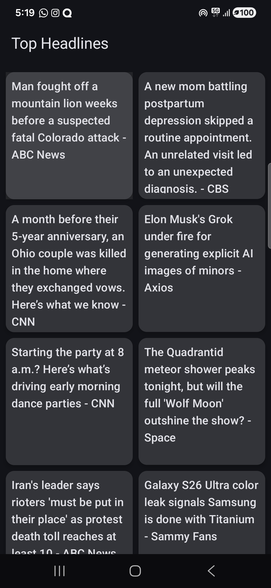
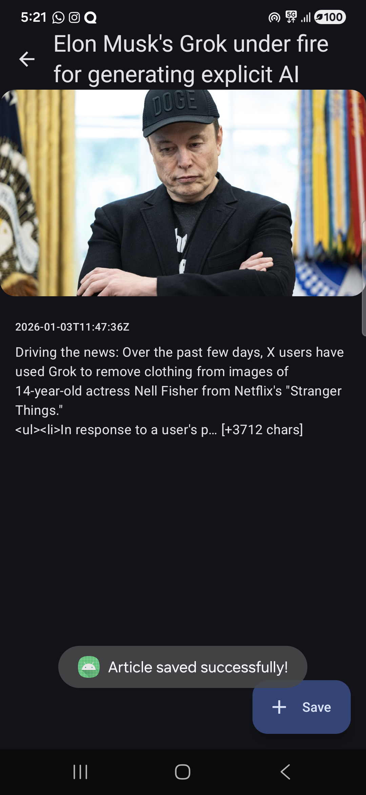

# NewsReading App

## Overview
NewsReading App is an Android application that fetches news articles from the News API
and displays them in a grid list. Users can select a specific news article to view
detailed information.

## Features
- Fetches latest news from News API
- Displays articles in a grid list using Jetpack Compose
- View detailed news content
- Save articles for offline access (if applicable)

## Tech Stack
- Kotlin
- Jetpack Compose
- MVVM + Clean Architecture
- Hilt (Dependency Injection)
- Coroutines & Flow
- Retrofit (News API)
- Protobuf (for saved articles - mockk answer currently no server)

## Architecture
The app follows Clean Architecture:
- Presentation (ViewModel, UI)
- Domain (Use Cases, Models)
- Data (Repository, API, Data Sources)

## Screens
- News List Screen (Grid)
- News Detail Screen

## API
Data is fetched from:
- [News API](https://newsapi.org/)

## Setup
1. Clone the repository
2. Create a `local.properties` at the root of the NewsReadingApp
3. Add your News API key to `local.properties like NEWS_API_KEY=your_key
4. Build and run the app

## Screenshots
### News List

### News Detail

### Save news Detail (mock)

